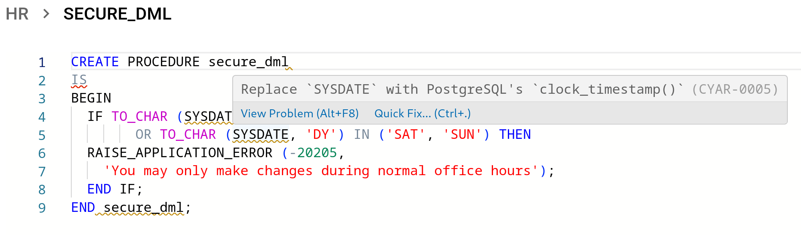
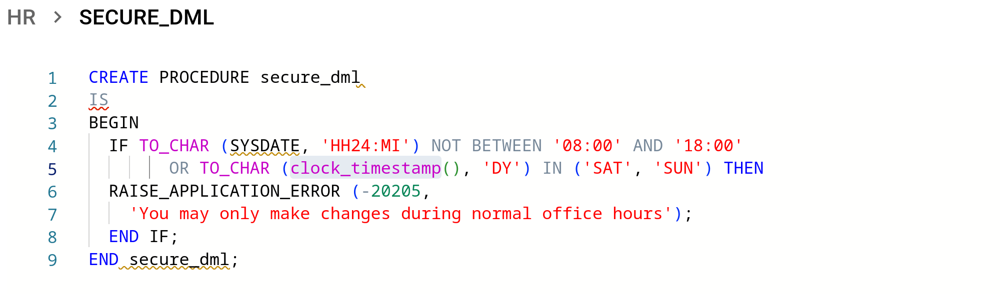

<p align="center">
  
  <br/><br/>
  <i>Streamlined Oracle to PostgreSQL migration</i>
</p>

---

<p align="center">
  <a href="#getting-started">Getting Started</a> •
  <a href="#running-the-migrator">Running the Migrator</a> •
  <a href="#contact">Contact</a>
</p>

[_CYBERTEC Migrator_](https://www.cybertec-postgresql.com/en/products/cybertec-migrator/) is a streamlined and user-friendly tool that helps you to organize and efficiently migrate multiple Oracle databases to PostgreSQL.
In addition to migrating your data professionally and securely with minimum effort, _CYBERTEC Migrator_ allows you to visually monitor and track the whole process at any time.

Do you want to know if the Migrator can migrate your Oracle database to PostgreSQL?
Then [get the Migrator Trial Edition](https://www.cybertec-postgresql.com/en/products/cybertec-migrator#form), a **free version** of the CYBERTEC Migrator, follow the offline instructions provided in [Getting Started](#offline-installation) section, and try it out.

The blog article [Meet the CYBERTEC Migrator](https://www.cybertec-postgresql.com/en/meet-the-cybertec-migrator/) provides a good introduction on how to migrate Oracle's HR demo schema to PostgreSQL.
Alternatively, you may want to watch the complementary [CYBERTEC Migrator YouTube playlist](https://www.youtube.com/playlist?list=PLt4uYyc72accw-Wi1Egn-IcOOSitK5Lcq).

<br/>

<p align="center">
  <a href="https://www.youtube.com/watch?v=z79_lZHmDG4&t=0s"></a><br/>
  <b>Product Demo</b>
</p>

---

For detailed information see the list of [supported migration features for Oracle](docs/oracle-migration-support.md).

## Table of Contents

1. [What's New](#whats-new)
1. [Getting Started](#getting-started)
1. [Running the Migrator](#running-the-migrator)
1. [Getting Help](#getting-help)
1. [Contact](#contact)
1. [License](#license)

## What's New

For older releases see [Release Notes](RELEASE_NOTES.md).

### v3.18.1 - 2023-09-18

#### Resolved Bugs

- `unable to connect to internal database: Error: Entity metadata for Schema#packages was not found. Check if you specified a correct entity object and if it's connected in the connection options.` \
  Fresh installation fails during the database setup.

### v3.18.0 - 2023-09-04

- _Automatic Code Transpilation_: Receive suggestions from the CYBERTEC Migrator when rewriting functions, procedures, triggers and views.

  <p align="left">
    
  </p>
  <p align="left">
    
  </p>

  For more information, see [Transpiler Features](./docs/transpiler-features.md).

#### ⚠️ Breaking changes

Beginning with this release, the Docker images include the edition in their name (e.g. `cybertecpostgresql/cybertec_migrator-professional-core`).
Furthermore, the `Standard` edition has been renamed to `Trial`; its features have been adapted accordingly.

**For users operating the installer:** Execute `./migrator configure --edition <edition>`. \
**Users operating on Kubernetes or OpenShift:** Please modify your configurations accordingly.

## Getting Started

### Requirements

_CYBERTEC Migrator_ is distributed as a set of [container images](https://github.com/opencontainers/image-spec/blob/main/spec.md) that are managed with the help of [Docker Compose](https://docs.docker.com/compose/).

- [`docker`](https://docs.docker.com/get-docker/)
- [`docker compose`](https://docs.docker.com/compose/install/) (`>= 2.0.0`)
- `git` (`>= 2.20.1`)
- `bash` (`>= 4.0`)

### Migrator Installation

The _CYBERTEC Migrator_ images can be obtained via two channels

- [Online installation via container registry](#online-installation)
- From an [offline installation](#offline-installation) package for environments in which networking restrictions are imposed

| 💡  | The Migrator Trial Edition is only available as an [offline installation package](https://www.cybertec-postgresql.com/en/products/cybertec-migrator#form) |
| --- |-----------------------------------------------------------------------------------------------------------------------------------------------------------|

#### Online installation

You need an account on the [Docker Hub](https://hub.docker.com/) container image registry.

Please [get in touch with us](#contact) if your account has not been granted access to the respective images.
Make sure you are logged in the Docker Hub registry with the correct user.

```sh
cat ~/password.txt | docker login --username <username> --password-stdin
```

1. Clone this git repository
2. Change working directory to the previously cloned repository
3. Generate default configuration with the respective edition
4. Download and load container images
5. Generate a self-signed TLS/SSL certificate or install a certificate (see [FAQ](docs/faq.md) for more details)
6. Start the Migrator

```sh
➜ git clone https://github.com/cybertec-postgresql/cybertec_migrator
➜ cd cybertec_migrator
➜ ./migrator configure professional
[OK] Generated environment file
[INFO] Run './migrator install' to complete setup
➜ ./migrator install
[INFO] Pulling images for professional:v3.18.0
Pulling core_db ... done
Pulling core    ... done
Pulling web_gui ... done
[OK] Pulled professional:v3.18.0
[INFO] Upgraded to professional:v3.18.0
[WARN] Could not find TLS/SSL certificate
[INFO] Run './migrator configure --tls self-signed-cert' to generate a self-signed TLS/SSL certificate
➜ ./migrator configure --tls self-signed-cert
[INFO] Generating self-signed TLS/SSL certificate
Creating cybertec_migrator_web_gui_run ... done
Generating a RSA private key
.+++++
........................+++++
writing new private key to '/etc/nginx/certs/nginx.key'
-----
You are about to be asked to enter information that will be incorporated
into your certificate request.
What you are about to enter is what is called a Distinguished Name or a DN.
There are quite a few fields but you can leave some blank
For some fields there will be a default value,
If you enter '.', the field will be left blank.
-----
Country Name (2 letter code) [AU]:AT
State or Province Name (full name) [Some-State]:Lower Austria
Locality Name (eg, city) []:Wöllersdorf
Organization Name (eg, company) [Internet Widgits Pty Ltd]:CYBERTEC PostgreSQL International GmbH
Organizational Unit Name (eg, section) []:CYBERTEC Solutions
Common Name (e.g. server FQDN or YOUR name) []:
Email Address []:invalid@cybertec.at
Creating cybertec_migrator_web_gui_run ... done
[OK] Generated self-signed TLS/SSL certificate
[INFO] Run './migrator up' to switch to new version
[WARN] Switching will abort running migrations
➜ ./migrator up
Recreating cybertec_migrator_core_db_1 ... done
Recreating cybertec_migrator_core_1    ... done
Recreating cybertec_migrator_web_gui_1 ... done
[OK] Started on 'https://localhost'
```

#### Offline installation

Get your Migrator offline installation package.
You can get the Migrator Trial Edition [here](https://www.cybertec-postgresql.com/en/products/cybertec-migrator#form) for free.
\
For the Professional or Enterprise Edition [get in touch with us](#contact) to request download credentials.

1. Extract the provided archive file
2. Change working directory to newly created directory
3. Generate default configuration with the respective edition
4. Import container images from archive
5. Generate a self-signed TLS/SSL certificate or install a certificate (see [FAQ](docs/faq.md) for more details)
6. Start the Migrator

```sh
➜ tar xf cybertec_migrator-trial-v3.18.0.tar.gz
➜ cd cybertec_migrator
➜ ./migrator configure trial
[OK] Generated environment file
[INFO] Run './migrator install --archive <archive_file>' to complete setup
➜ ./migrator install --archive ../cybertec_migrator-trial-v3.18.0.tar.gz                                                                                                                                                                                                                                                            ✔  at 15:37:52  
[INFO] Reading meta-information from archive file '../cybertec_migrator-trial-v3.18.0.tar.gz'
[INFO] Upgrading to trial:v3.18.0
[INFO] Extracting archive file '../cybertec_migrator-trial-v3.18.0.tar.gz'
[INFO] Loading container images
Loaded image: cybertecpostgresql/cybertec_migrator-trial-core:v3.18.0
Loaded image: cybertecpostgresql/cybertec_migrator-trial-web_gui:v3.18.0
Loaded image: postgres:13-alpine
[INFO] Container images loaded
[INFO] Archived container images
[INFO] Upgraded to trial:v3.18.0
[WARN] Could not find TLS/SSL certificate
[INFO] Run './migrator configure --tls self-signed-cert' to generate a self-signed TLS/SSL certificate
➜ ./migrator configure --tls self-signed-cert
[INFO] Generating self-signed TLS/SSL certificate
Creating cybertec_migrator_web_gui_run ... done
Generating a RSA private key
.+++++
........................+++++
writing new private key to '/etc/nginx/certs/nginx.key'
-----
You are about to be asked to enter information that will be incorporated
into your certificate request.
What you are about to enter is what is called a Distinguished Name or a DN.
There are quite a few fields but you can leave some blank
For some fields there will be a default value,
If you enter '.', the field will be left blank.
-----
Country Name (2 letter code) [AU]:AT
State or Province Name (full name) [Some-State]:Lower Austria
Locality Name (eg, city) []:Wöllersdorf
Organization Name (eg, company) [Internet Widgits Pty Ltd]:CYBERTEC PostgreSQL International GmbH
Organizational Unit Name (eg, section) []:CYBERTEC Solutions
Common Name (e.g. server FQDN or YOUR name) []:
Email Address []:invalid@cybertec.at
Creating cybertec_migrator_web_gui_run ... done
[OK] Generated self-signed TLS/SSL certificate
[INFO] Run './migrator up' to switch to new version
[WARN] Switching will abort running migrations
➜ ./migrator up
Recreating cybertec_migrator_core_db_1 ... done
Recreating cybertec_migrator_core_1    ... done
Recreating cybertec_migrator_web_gui_1 ... done
[OK] Started on 'https://localhost'
```

## Running the Migrator

Use your web browser to access the Migrator on the URL shown in the terminal with `migrator up`. In our example it would be `https://localhost`.

The configuration provided with this repository starts the CYBERTEC Migrator on the standard HTTPS port.
The `EXTERNAL_HTTP_PORT` variable in the `.env` file (generated by `./migrator configure`) controls the choice of port on which the Migrator is served.

If you don't have access to an Oracle or PostgreSQL database to test the Migrator, use our [Migrator demo database environment](https://github.com/cybertec-postgresql/cybertec_migrator_demo).

### Upgrades

| ⚠️  | Running migrations _will_ be interrupted by applying upgrades |
| --- | ------------------------------------------------------------- |

> **Attention**  
> If you upgrade from a Migrator version previous of 3.11.0 you have to create the TLS/SSL certificate after upgrading to the new version, **before restarting** the new Migrator.
>
> ```sh
> ./migrator update
> ./migrator upgrade
> # Don't forget the create or install a TLS/SSL certificate
> ./migrator configure --tls self-signed-cert
> ./migrator up
> ```

- Online upgrade

  1. Update release information
  2. Upgrade to newest version
  3. Apply upgrade

  <br/>

  ```sh
  ./migrator update
  ./migrator upgrade
  ./migrator up
  ```

- Offline upgrade

  | 💡  | Installation archives also serve for upgrading the Migrator |
  | --- | ----------------------------------------------------------- |

  1. Update release information
  2. Upgrade to version bundled in archive
  3. Apply upgrade

  <br/>

  ```sh
  ./migrator update --archive cybertec_migrator-edition-vX.Y.Z.tar.gz
  ./migrator upgrade --archive cybertec_migrator-edition-vX.Y.Z.tar.gz
  ./migrator up
  ```

## Automatic Code Transpilation

The CYBERTEC Migrator is able to parse, analyze and transpile certain PL/SQL constructs to PL/pgSQL automatically.
For more information, see [Transpiler Features](./docs/transpiler-features.md).

## Getting Help

If you have a questions maybe you want to check the [Migrator FAQ](docs/faq.md).
If you can't find the answer there you may have more luck in one of the [existing questions](https://github.com/cybertec-postgresql/cybertec_migrator/issues?q=label%3Aquestion+).

Raising an [issue](https://github.com/cybertec-postgresql/cybertec_migrator/issues/new/choose) is encouraged.
We have templates to report bugs, requesting a new feature or for general questions.

Customers of the paid Migrator license may use the [Migrator Service Desk](https://cybertec.atlassian.net/servicedesk/customer/portal/3/group/-1).

## Contact

- [Sales](https://www.cybertec-postgresql.com/en/contact/)

## License

The content of this repository is under the [MIT License](LICENSE) in case you have to adapt the deployment to your needs.
The CYBERTEC Migrator delivered in the container images uses a proprietary license with an [EULA](EULA.md).
