## CYBERTEC Migrator - Release Notes

The release notes of the last release may be found on [README.md](README.md#whats-new).

### v3.13.0 - 2022-11-30

#### Features

- _Migration Assessment_:

  - Quickly determine how much effort an individual migration encompasses
    <p align="left">
      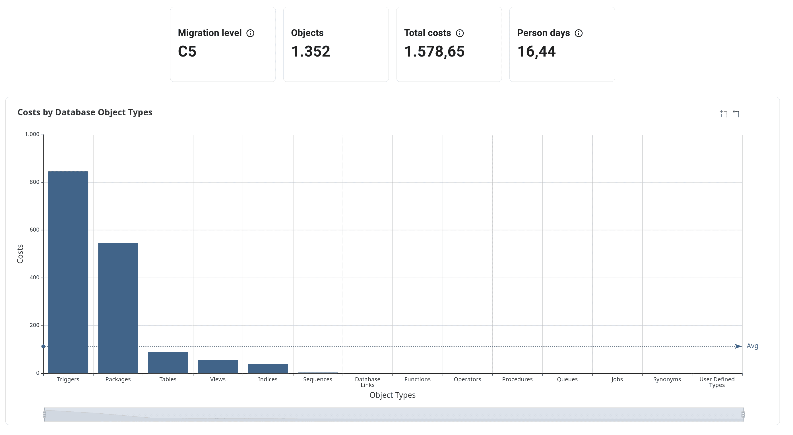
    </p>
  - Inspect the cost for discrete database objects and identify outliers
    <p align="left">
      
    </p>

  > Note: The figures given by the assessment are only a rough estimation. \
  > We will continue to tweak and improve these values as we collect experience and introduce new technologies, such as a PL/SQL parser.

- _Migration Overview_: List empty and non-empty schemas separately
  <p align="left">
    
  </p>

  > Note: Empty schemas are now excluded per default

- _Migration Creation_: Improve feedback for invalid connection strings
  <p align="left">
    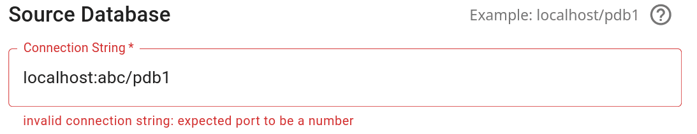
  </p>

- _Migration Lifecycle_:

  - Defer the creation of functions after those of tables to allow for the use of the `%TYPE` attribute
  - Enhance the migration log of the structure, integrity and logic stages to be on a par with those of the data stage
  - Configure the `COPY FREEZE` functionality introduced in `v3.12.0` for each individual table instead of the whole system.
    The `CORE_DATA_MIGRATOR_USE_COPY_FREEZE` environment variable has subsequently been removed.

- _Miscellaneous_: Rework the log output format and fidelity throughout the `core` container

#### Resolved Bugs

- The Analyze step of the migration creation always shows `Jobs` as pending
- LOBs exceeding the maximum size of 500MB do not fail with an appropriate error message
- Setting the sidebar filter to `Index` does not include all indexes in the filter result
- Usernames and passwords containing special characters cause the target connection check during migration creation to fail
- Deleting a migration after executing a stage fails with an unexpected error

### v3.12.0 - 2022-10-25

#### Features

- Enhance migration log in the data stage:

  - Improve summary of the start and end logs

    ```text
    resumed data stage from oracle://localhost:1521/pdb1 to postgresql://localhost:5432/postgres: using 8 workers
      excluded tables: 1
      successful transfers: 1 (out of 7)
      remaining transfers: 6

    ...

    failed executing data stage: stage run-time 00:01:534
      excluded tables: 1
      successful transfers: 6 (out of 7)
      remaining transfers: 1
      failed transfers: 1
    ```

  - Print a warning if the source and/or target connection are not encrypted
    ```text
    Info     Data  using secure connection to read data from oracle://pdb_sec [oracle://10.0.0.127:2484/pdb?protocol=tcps]
    Warning  Data  using insecure connection to write data to postgresql://localhost:5432/postgres
    ```
  - Periodically log `data-migrator` transfer statistics for each table.
    This interval may be set using the [`CORE_DATA_MIGRATOR_PROGRESS_INTERVAL` environment variable](docs/faq.md#how-do-i-set-environment-variables) (default: `600000` milliseconds, `10` minutes)

    ```text
    Verbose  Data  loading data for table:"HR"."EMPLOYEES" [hr.employees]: processed 982 rows in 01:20.000 - 45 rows/sec (total: 41 rows/sec in 05:00.000)
    Verbose  Data  finished loading data for table:"HR"."EMPLOYEES" [hr.employees]: processed 1012 rows in 00:02:01 - 40 rows/sec
    ```

- Quote reserved identifiers when generating data queries for both Oracle and PostgreSQL
- Add support for **secured communication** (TCPS) access to Oracle databases without using a _net service name_.
  For details, check out our [FAQ - How do I configure TCPS for Oracle databases](docs/faq.md#how-do-i-configure-tcps-for-oracle-databases) section
- Configure the [`FREEZE` parameter](https://www.postgresql.org/docs/current/sql-copy.html) during the data transfer by setting the [`CORE_DATA_MIGRATOR_USE_COPY_FREEZE` environment variable](docs/faq.md#how-do-i-set-environment-variables) (default: `false`).
  Only use this setting if you are aware of its implications

#### Resolved Bugs

- An error on the target connection during the structure, integrity or logic stage may cause the Migrator core to crash

### v3.11.1 - 2022-10-05

#### Resolved Bugs

- Data stage reported as successful for certain corner cases when transfer failed with `No space left on device`
- Connectivity check to PostgreSQL with connection parameters fails when port is omitted (`FATAL: database does not exist`)
- Failed to read data from Oracle for tables with lowercase identifiers
- Regression: can not provide hostname with '-' in connection string

### v3.11.0 - 2022-09-28

#### Features

- Add support for Oracle 11 (closes #14).
- We changed the default configuration of the reverse proxy to use HTTPS.  
  This means you have to **install a TLS/SSL certificate** or create a self signed certificate, otherwise the web-server will refuse to start.
  To facilitate the installation of the certificate we added a new option `--tls` to the `migrator configure` command.
  Check out the [FAQ](docs/faq.md) for detailed information how to install a TLS/SSL certificate.

  ```sh
  migrator configure --tls self-signed-cert       Generate self-signed TLS/SSL certificate
  migrator configure --tls cert:<file-location>   Install TLS/SSL certificate
  migrator configure --tls key:<file-location>    Install private key of TLS/SSL certificate
  ```

  > **Attention**  
  > If you upgrade from a previous Migrator version you have to create the TLS/SSL certificate after upgrading to the new version, **before restarting** the new Migrator.
  >
  > ```sh
  > ./migrator update
  > ./migrator upgrade
  > # Don't forget the create or install a TLS/SSL certificate
  > ./migrator configure --tls self-signed-cert
  > ./migrator up
  > ```

- Add support for **secured communication** (TCPS) access to Oracle databases. For details check our [FAQ - How do I configure TCPS for Oracle databases?](docs/faq.md#how-do-i-configure-tcps-for-oracle-databases).
- Read meta-data of additional Oracle database object types: **jobs** and **operators**
  <p align="left">
    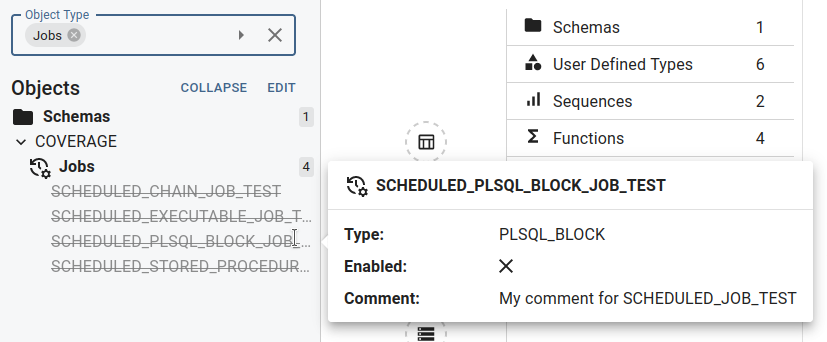
    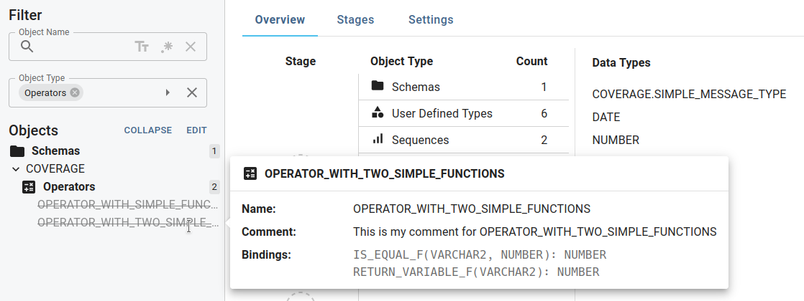
  </p>
- Users may provide a custom **Data Query**, thus manipulating the `SELECT` statement executed on the source database to migrate the data.
  <p align="left">
    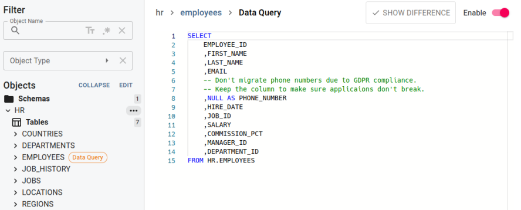
  </p>
  A few use cases where this feature may be useful:

  - Migrate the table partially by filtering rows with `WHERE`
  - Migrate only the table structure but no data (`WHERE ROWID < 0`)
  - You want to keep the table structure, but not the data of a specific column (see screenshot above)
  - Retrieve (and thus insert) the data in a specific `ORDER BY`
  - Convert the column data of an unsupported data type into a string representation which can be “cast” into a valid PostgreSQL type via the COPY statement

- Improve output for erroneous SQL execution when reading Oracle meta-data.

#### Resolved Bugs

- Columns starting with `SYS` are not included in primary keys or unique constraints
- Data stage fails when column is named after an SQL reserved keywords (for example `IN`)

### v3.10.1 - 2022-09-08

#### Resolved Bugs

- Creating a migration for Oracle 11 and below fails on reading out sequences due to a non-existent table
- The `lower_bound` of range subpartitions is not determined correctly during migration creation
- Running the Structure stage with `REFERENCE` partitions results in a non-descriptive error
- Regression in v3.10.0 causing the data of individual partitions to not be migrated correctly
- Code editors mark their complete content as erroneous instead of only the faulty section
- Revert style changes in the search and replace panel

### v3.10.0 - 2022-08-31

#### Features

- Improve _Search Panel_:
  - Search package specifications and bodies
  - Consolidate DBO type filter into a single input
    <p align="left">
      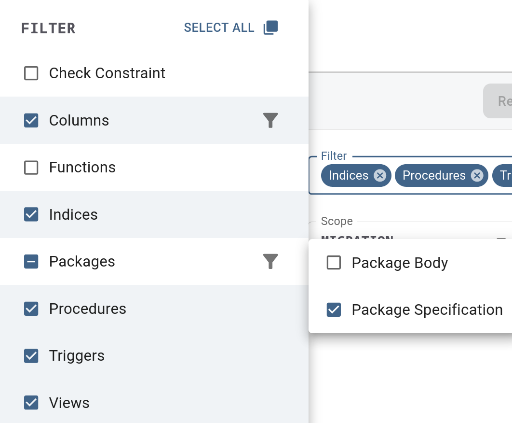
    </p>
  - Select multiple search results to replace at once
    - `Shift-Click` to add multiple rows
    - `Ctrl-Click` to add/remove a single row
    <p align="left">
      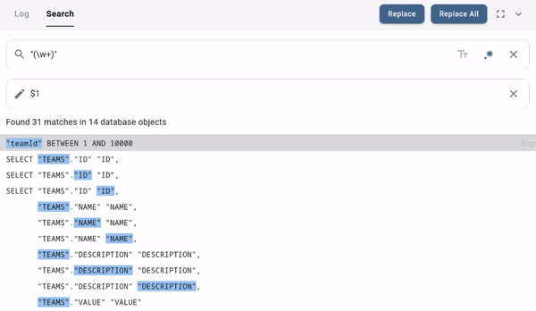
    </p>
  - Improve keyboard navigation when using `<Tab>`
- Show information for Oracle _Queues_ in the Sidebar
  <p align="left">
    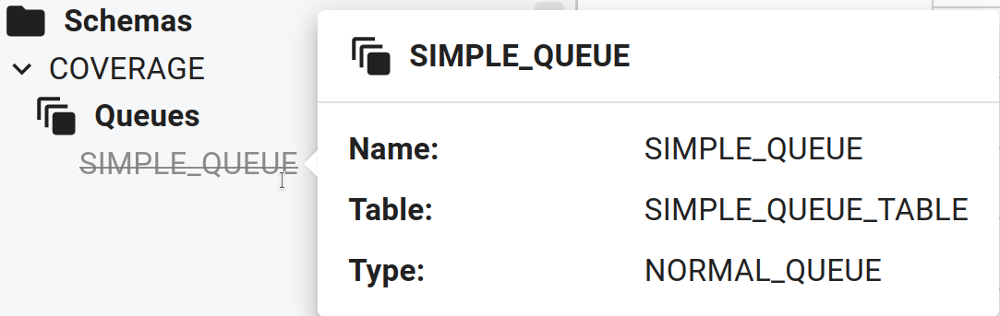
  </p>

#### Resolved Bugs

- DBO creation fails due to global `lock_timeout` setting on target database
- Running `ps` inside the core container during the data stage reveals the database passwords
- Abort of data stage may sometimes hang indefinitely

### v3.9.0 - 2022-07-26

#### Features

- Improve _Sidebar_:
  - Show meta-data as pop-up for constraints and indices
    <p align="left">
        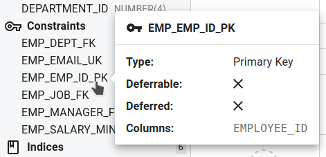
        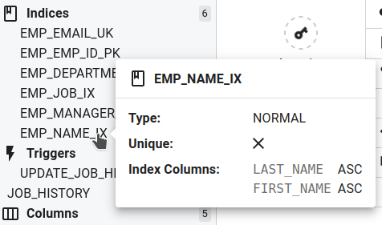
    </p>
  - Extend the Object Type filter options with `Partitions` and provide granularity for `Indexes` (`Unique`, `Functional`, and `Domain`)
    <p align="left">
        
    </p>
- _Migration Overview_: Additional index types on _Indices_ drill down
  <p align="left">
  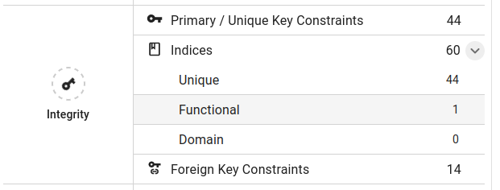
  </p>
- Switch Migrator core to the native `libpq` PostgreSQL driver to support additional authentication methods (e.g. GSSAPI)
- Recurring security maintenance: upgrade package dependencies with known vulnerabilities to newest version

#### Resolved Bugs

- PostgreSQL authentication with AuthenticationGSS causes a crash
- Importing an Oracle View with a Null-Byte results in an unresponsive state
- Unexpected shutdown of the target PostgreSQL connection may cause a crash

### v3.8.0 - 2022-06-29

#### Features

- Configure the maximal number of parallel data transfers and index creation workers for each migration.  
  The Migrator picks reasonable default values when a new migration is created:
  - `Data Tranfers`: number of CPUs where the Migrator is hosted
  - `Database Workers`: number of CPUs of the target database. Make sure to tune this parameter with the PostgreSQL configuration of [max_worker_processes, max_parallel_workers, max_parallel_maintenance_workers](https://www.postgresql.org/docs/current/runtime-config-resource.html)
  <p align="left">
      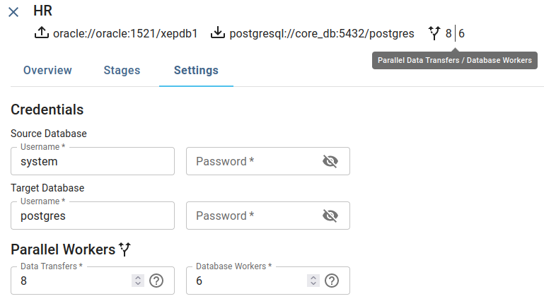</img>
  </p>
- Enhance sidebar: show synonym meta-data as pop-up
  <p align="left">
      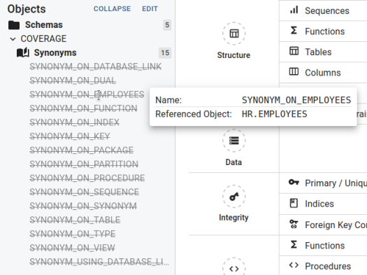</img>
  </p>
- Set/clear object type filter by selecting an `Object Type` in the overview tab. Use the `CTRL` key to filter for more than one database object type.
  <p align="left">
      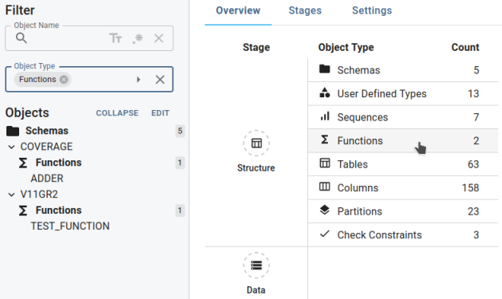</img>
  </p>
- Add [issue templates](https://github.com/cybertec-postgresql/cybertec_migrator/issues/new/choose) for asking questions.

#### Resolved Bugs

- Empty connection check error message on `504 Gateway Time-Out`
- Broken GUI workflow in the Analyze step on `504 Gateway Time-Out`
- Error on migrating `REVERSE` indexes: PostgreSQL does not have/need an equivalent feature
- Opening a non-existent migration endlessly shows the loading animation
- Error on migrating sequences with negative `INCREMENT` - `START value cannot be greater than MAXVALUE`
- Migration controls (resume, continue, etc.) occasionally do not behave as expected
- Views depending on other views are not created in the correct order
- Spacing between the migration log time and level is jumping
- Incorrect name conflict detection for tables and triggers with the same identifier

### v3.7.0 - 2022-05-18

Do you want to know if the Migrator can migrate your Oracle database to PostgreSQL?

Then [get the Migrator Standard Edition](https://www.cybertec-postgresql.com/en/products/cybertec-migrator#form), a **free version** (as in beer) of the CYBERTEC Migrator, follow the offline instructions provided in [Getting Started](#offline-installation) section, and try it out.

#### Features

- Improve migration job execution (which removed the Redis job queue as a dependency)
- Provide help menu to reach out to CYBERTEC
- Provide a [Migrator demo database environment](https://github.com/cybertec-postgresql/cybertec_migrator_demo) to facilitate a test-run of the Migrator Standard Edition
- Added [License](#license) information

#### Resolved Bugs

- Error when attempting to edit a function, procedure, trigger or view containing a `#` in its name
- Trigger Type and Level can be changed even if the trigger is excluded
- Column data-types qualified with `SYS` are not translated properly

### v3.6.0 - 2022-04-26

#### Features

- Add support for **stage post-hook SQL scripts** to adapt the migration with functionalities not provided by the Migrator.
  The scripts are executed at the end of a stage.
  Typical use cases for such scripts are to create database objects which are not present in the source database, or to define ownership and access permissions.
  - Add a stage post-hook script in the _Stages Tab_.
    <p align="left">
        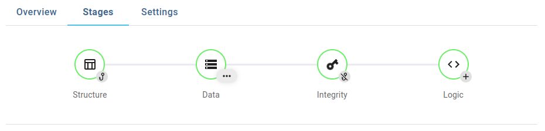</img>
    </p>
  - Editor for stage hook scripts. It is possible to temporary disable a hook script.
    <p align="left">
        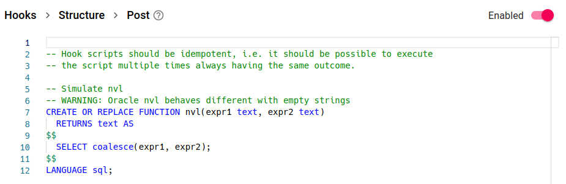</img>
    </p>
  - The execution of the stage post-hook scripts are **logged for audit purposes**.
    <p align="left">
        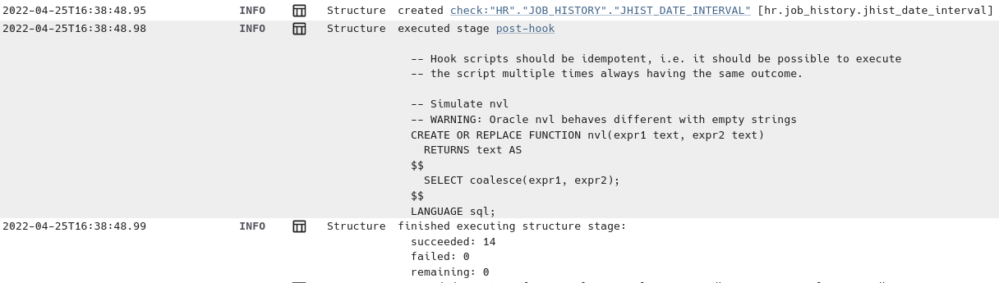</img>
    </p>
- Improve _Data stage_: list and range **partitions and sub-partitions** of partitioned tables are **migrated in parallel**.
- Support migration of `GENERATED AS IDENTITY` constraint.
- Improve user experience:
  - Code editors verify DDL code to provide fast error feedback.
    <p align="left">
        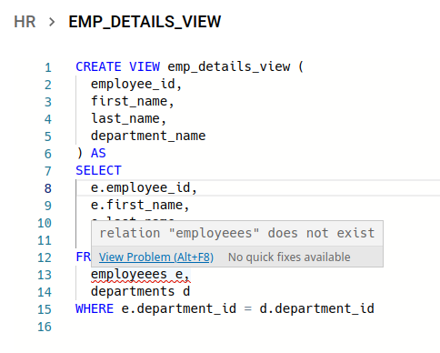</img>
    </p>
  - Add keyboard hotkey `Ctrl`-`Enter` to start migration job execution.

#### Resolved Bugs

- Failed to created migration of an Oracle database containing a column that uses a data-type from the `SYS` schema
- Starting a migration job with more than one stage and incorrect target connection bricks the migration
- Sidebar filter showing schemas that contain none of the filter results
- Misleading console log entries `No metadata found. There is more than once class-validator version installed probably ...`

### v3.5.0 - 2022-03-29

#### Features

- Several improvements in the execution of a migration:
  - Swap **execution order of _Integrity_ and _Logic_ stage**.
    Having indices in the Logic stage makes it easier to test performance of views, stored procedures and triggers.
    <p align="left">
        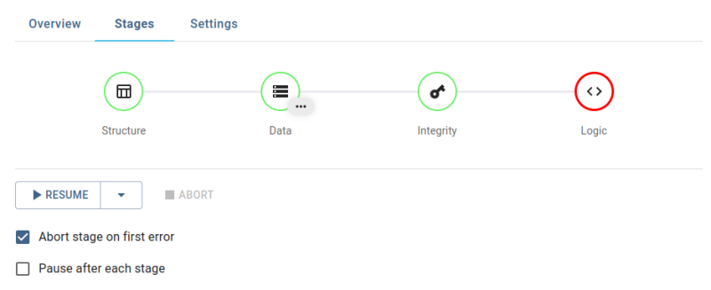</img>
    </p>
  - Move **creation of [check constraints](https://www.postgresql.org/docs/current/ddl-constraints.html#DDL-CONSTRAINTS-CHECK-CONSTRAINTS) from Logic into Structure stage**.
    Checking the data during the data bulk load is negligible compared to the time needed to re-read the table from disk in the Logic stage.
  - As a consequence, **functions are created in the Structure stage** prior to tables, since they may be used by check constraints.
    The Logic stage re-creates the functions once again still providing the means for fast change-test round-trips.
- The _Migration Overview_ was updated to reflect the changes in the migration execution:
  - It is visible in which order the database objects are created: first schemas, then user defined types, followed by sequences, etc.
    <p align="left">
        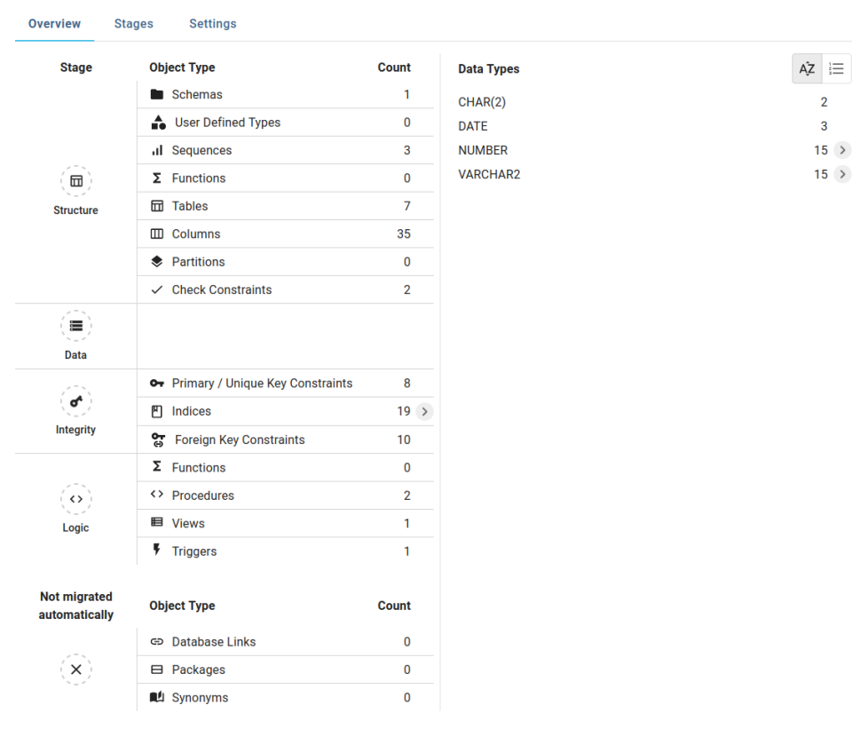</img>
    </p>
  - Provide drill down on _Indices_ entry to show the number of unique indices. We will enrich the _Migration Overview_ with additional information in future releases.
    <p align="left">
        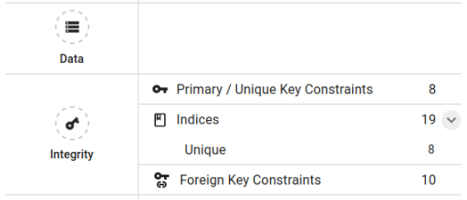</img>
    </p>
- Enhance migration configuration:
  - Constraint Renaming  
    Rename constraints in case there are naming collisions with other database objects.
    <p align="left">
        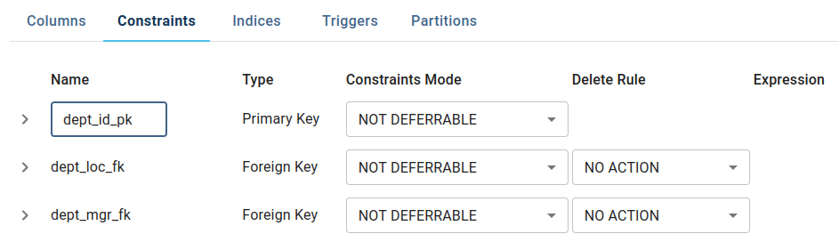</img>
    </p>
- Improve handling of implicitly created indices via [Unique Constraints](https://www.postgresql.org/docs/current/ddl-constraints.html#DDL-CONSTRAINTS-UNIQUE-CONSTRAINTS) or [Primary Keys](https://www.postgresql.org/docs/current/ddl-constraints.html#DDL-CONSTRAINTS-PRIMARY-KEYS):
  - Show implicitly created indices in the sidebar and the _Indices_ view. In our example, `dept_id_pk` is shown in the _Constraints_ as well as the _Indices_ section.
  - A hyperlink in the _Indices_ view facilitates navigation to the constraint.
    <p align="left">
        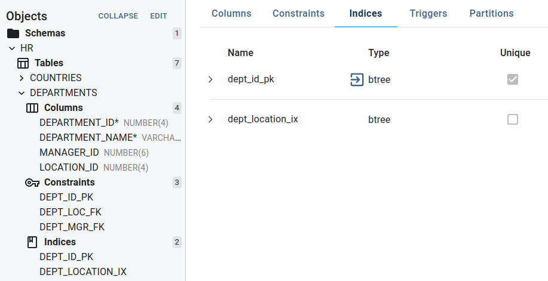</img>
    </p>
  - Rename implicitly created indices by renaming its constraint.
- _Log view_ shows detailed information about the started migration job:
  <p align="left">
      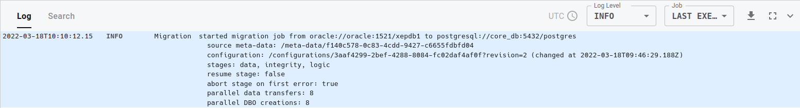</img>
  </p>
- Improve _Sidebar_:
  - Object Type Filter: add option for User Defined Types (UDT).

#### Resolved Bugs

- Cloning a migration fails due to missing database object in the source database (dropped or renamed table, dropped column, etc.)
- Integrity stage `ERROR: timeout exceeded when trying to connect`
- Integrity stage keeps processing workers after an error even with enabled "Abort stage on first error"
- Resume of an aborted job fails when the Migrator core was forcefully shut down
- Core dump due to repeated, large error message (`warn: Unable to process subpartition ... table not found`)
- Functional index with an expression containing a number was not migrated
- Overview page does now show 0 database links, synonyms, packages

### v3.4.3 - 2022-03-04

This is a bugfix release for [v3.4.0](RELEASE_NOTES.md).

> **Note**: v3.4.1 and v3.4.2 were not released.

#### Resolved Bugs

- Foreign keys are not created in parallel
- Import fails for databases with a view on a view
- Import fails for databases with a partition of a non-imported table (i.e. temporary, secondary, nested, or dropped table)

### v3.4.2

Not released.

### v3.4.1

Not released.

### v3.4.0 - 2022-02-24

The main focus of this release is improving the performance for reading the source database meta-data (we tested databases with approximately 400.000 database objects).
This includes improvements to the GUI to be responsive with a large number of database objects.

> **NOTE**  
> After starting the migrator the dashboard may show an error until the Migrator converted existing migrations in its internal database.
> Depending on the number and size of existing migrations this may take some time.

#### Features

- Reading and analyzing the source database meta-data is now faster
- _Overview page_: drill down to show specific data types
- Improve _Sidebar_:
  - Show number of database objects
  - Add new `Constraints` Object Type filter (`Check`, `Foreign Keys`, and `Unique/Primary Keys`)
  - Add `Disable Partitioning` for multiple tables
- Improve _Search and Replace_
  - Include index names
  - Scope search with sidebar filter
- Highlight element in the table editor when selected in the sidebar or when navigated from the log view
- _Log View_:
  - Scope log entries based on job execution: `ALL`, `CURRENT MIGRATION`, and `LAST EXECUTED JOB`
  - Download content of log view

#### Resolved Bugs

- Creating a migration of a database with a large number of DBOs fails
- Unable to save large configuration changes
- `Partitions` tab not responsive for a table with large number of partitions (>500)
- Resuming data stage results in migrating the data from a different SCN
- Data stage was not aborted properly by user request

### v3.3.0 - 2021-12-21

#### Features

- Show information of additional Oracle database object types
  - Database links
  - Packages (specification and body)
  - Synonyms
- Show procedures and functions as separate types (until now both types were shown under `Functions`)
- Improve data transfer for Oracle `BLOB, CLOB, NCLOB` and `BFILE` columns for rows with big LOBs.
  This may fix out-of-memory errors on the Oracle side, namely `MSG: ORA-01062: unable to allocate memory for define buffer`.
  It also _significantly_ reduces the Migrator memory footprint.
- The transfer of a row containing a LOB bigger than 500MB will abort with an informative error message.

#### Resolved Bugs

- Creating a migration of a database with invisible columns causes a failure during meta-data import
  (`null value in column "position" of relation "table_column" violates not-null constraint`)

### v3.2.0 - 2021-11-26

#### Features

- Enhanced migration configuration:
  - Index Renaming  
    Rename indices in case there are naming collisions with other database objects
  - Primary/Unique Key Modification  
    Add, remove and change the order of table columns in a primary/unique key
- Browser Tab Syncing  
  Work on the same migration in multiple browser tabs, with them being synced in real-time
- _Search and Replace_ on check constraints and expression indexes
- Usability Improvements
  - Improved sidebar functionalities:
    - Object Type filter: add options for indices, triggers, and sequences
    - Bulk exclude of schemata and tables
  - The tabs in the table editor (Columns, Constraints, etc.) display the identifiers used in the target database
  - Provide examples for source and target connection strings when creating new migrations
  - Performance improvements when running migration jobs
  - Provide more concise error details when writing database objects to the target database (e.g. miss-matching foreign key data-types)

#### Resolved Bugs

- Creating a migration of a database with a view containing numerous columns causes a failure during meta-data import (`ORA-40478: output value too large (maximum: 4000)`)
- Creating a migration with an unreachable host shows a non-descriptive error
- _Replace All_ on different database object types sometimes doesn't replace all search results

### v3.1.0 - 2021-10-20

#### Features

- _Search and Replace_  
  Perform bulk changes on column data types / default values, functions, views, and triggers (with support for even more object properties coming soon)

- Significant Speed Improvements  
  **Feel** the difference

- Resume Failed Stages  
  Spend less time fixing those last few migration errors

- Realtime Syntax Checking  
  Get immediate feedback about the syntactical correctness of code

- Partition Renaming  
  Rename partitions as part of a migration instead of altering the source database

- Code Export  
  Export code of function / views / triggers (with code import coming soon)

- Migration Deletion  
  Delete of completed migrations

- Migration Cloning  
  Prepare migrations against your staging environment and then execute them against production

#### Resolved Bugs

- Keys for excluded columns are not excluded automatically
- Column aliases in view code are not migrated
- Migration status is sometimes displayed incorrectly
- Excluding partition columns via the sidebar prevents the Structure stage from succeeding

### v3.0.0 - 2022-09-16

With _CYBERTEC Migrator_ v3 we've rebuilt the GUI from the ground up to simplify database migrations even further

- Get a brief look at the structure of your source database by using the migration _Overview_
- Quickly drill down into your data model with the help of the new _Sidebar_
- Stages (natural synchronization points of a migration process) now guide you through the migration process
  - **Structure** stage: create database objects necessary to migrate the table data
  - **Data** stage: migrate table data in parallel
  - **Logic** stage: create functions, triggers, views
  - **Integrity** stage: parallel creation of primary keys, indices, foreign keys, and constraint checks
- Enjoy quick round trips and gain confidence in the correctness of your migration thanks to the reworked _Migration Controls_
  - **Start** migration from the beginning
  - **Rerun stage** in case of an error
  - **Continue** to next stage
  - **Abort** migration and restart at any time
- Explore the inner workings of your migration with the new, and easily accessible _Log View_
  - Log entries are inter-linked to the database objects configuration
  - Filter on log level (`ERROR`, `WARNING`, `INFO`, `VERBOSE`)
- Extensive configuration
  - Exclude database objects (schemas, tables, columns, indexes, ...) from migration
  - Table editor to configure columns, constraints, indices, triggers, and partitions
  - Bulk change of data types (for example change all `NUMBER(4)` to `int`, instead of `smallint`)
  - Integrated code editor for functions, stored procedures, and views with diff feature
